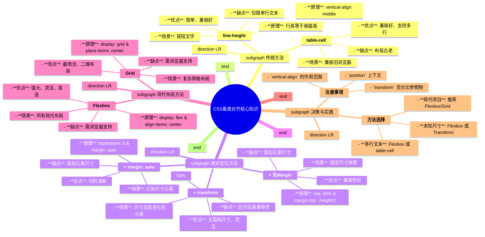

# CSS 垂直对齐技术文档

### 一、 基础概念

CSS垂直对齐是指将一个或多个子元素在其父容器的垂直方向上居中排列。这是Web布局中一个常见且重要的需求。

### 二、 核心方法论

#### 类别一：传统方法

##### 1. `line-height`（行高法）

*   **核心原理**：将元素的 `line-height` 设置为与父容器高度相等的值，利用行高等于容器高的特性使单行文本垂直居中。
*   **实现代码**：
    ```css
    .container {
        height: 200px;
        line-height: 200px;
    }
    ```
*   **适用场景**：单行文本、按钮内文字等。
*   **优缺点**：
    *   **优点**：代码极其简单，兼容性好。
    *   **缺点**：仅对单行内联元素（如文本、`<span>`）有效，多行文本会错乱。

##### 2. `display: table-cell`（模拟表格单元格）

*   **核心原理**：将父容器的 `display` 属性设置为 `table-cell`，然后使用 `vertical-align: middle` 来实现内容垂直居中。
*   **实现代码**：
    ```css
    .container {
        display: table-cell;
        vertical-align: middle;
    }
    ```
*   **适用场景**：需要兼容旧浏览器的多行文本或块级元素垂直居中。
*   **优缺点**：
    *   **优点**：兼容性好，能很好地处理多行文本。
    *   **缺点**：布局方式相对古老，可能会与其他现代布局属性（如Flexbox）冲突。

#### 类别二：绝对定位法 (`position: absolute`)

**前置条件**：父容器需设置 `position: relative` 或其他非 `static` 的定位。

##### 3. 绝对定位 + 负外边距 (`margin`)

*   **核心原理**：将子元素 `top` 设置为 `50%`，然后通过 `margin-top` 向上移动自身高度的一半。
*   **实现代码**：
    ```css
    .item {
        position: absolute;
        top: 50%;
        height: 100px; /* 元素高度必须已知 */
        margin-top: -50px; /* 值为 -height/2 */
    }
    ```
*   **适用场景**：弹窗（Modal）、需要精确定位的固定尺寸元素。
*   **优缺点**：
    *   **优点**：兼容性好，是一种经典的解决方案。
    *   **缺点**：必须预先知道子元素的具体尺寸，维护性差。

##### 4. 绝对定位 + `transform`

*   **核心原理**：将子元素 `top` 设置为 `50%`，然后使用 `transform: translateY(-50%)` 向上移动自身高度的50%。
*   **实现代码**：
    ```css
    .item {
        position: absolute;
        top: 50%;
        transform: translateY(-50%);
    }
    ```
*   **适用场景**：元素尺寸未知或动态变化的垂直居中场景。
*   **优缺点**：
    *   **优点**：无需知道元素尺寸，代码简洁，灵活性和维护性高。
    *   **缺点**：`transform` 属性可能影响子元素的其他变换效果，且存在浏览器兼容性问题（现代浏览器已支持良好）。

##### 5. 绝对定位 + `margin: auto`

*   **核心原理**：将子元素四边定位都设置为 `0`，再设置 `margin: auto`，浏览器会自动计算外边距使其在父容器中居中。
*   **实现代码**：
    ```css
    .item {
        position: absolute;
        top: 0;
        bottom: 0;
        left: 0; /* 水平居中需要 */
        right: 0; /* 水平居中需要 */
        margin: auto;
        height: 50px; /* 元素尺寸必须已知 */
        width: 100px; /* 元素尺寸必须已知 */
    }
    ```
*   **适用场景**：已知尺寸的元素在父容器中完全居中。
*   **优缺点**：
    *   **优点**：代码清晰，无需复杂计算。
    *   **缺点**：必须明确设置子元素的宽高。

#### 类别三：现代布局方案

##### 6. Flexbox 布局

*   **核心原理**：利用Flexbox的交叉轴对齐特性，将父容器设置为 `display: flex`，然后通过 `align-items: center` 实现子元素垂直居中。
*   **实现代码**：
    ```css
    .container {
        display: flex;
        align-items: center; /* 垂直居中 */
        justify-content: center; /* 水平居中 (可选) */
    }
    ```
*   **适用场景**：几乎所有垂直居中场景，尤其适合响应式设计和复杂组件布局。是现代CSS布局的首选方案。
*   **优缺点**：
    *   **优点**：极其简单、强大、灵活，能轻松处理不同尺寸的元素，代码可读性强。
    *   **缺点**：需要注意浏览器兼容性（现代浏览器已普及）。

##### 7. Grid 布局

*   **核心原理**：Grid布局提供了更强大的二维对齐能力，将父容器设置为 `display: grid`，然后使用 `place-items: center` 简写属性可同时实现水平和垂直居中。
*   **实现代码**：
    ```css
    .container {
        display: grid;
        place-items: center; /* 同时实现水平和垂直居中 */
    }
    ```
*   **适用场景**：二维布局、整体页面布局、卡片内容居中等。
*   **优缺点**：
    *   **优点**：功能强大，代码最简洁，专为复杂二维布局设计。
    *   **缺点**：比Flexbox更晚出现，需关注目标用户的浏览器支持情况。

### 三、 方法选择与最佳实践

*   **单行文本**：优先使用 `line-height`。
*   **未知尺寸元素**：首选 **Flexbox** 或 **绝对定位 + `transform`**。
*   **多行文本**：首选 **Flexbox**，备选 `table-cell`（兼容旧浏览器）。
*   **现代项目/响应式布局**：强烈推荐 **Flexbox** 或 **Grid**，它们最灵活且易于维护。
*   **固定尺寸弹窗**：`绝对定位 + 负外边距` 或 `绝对定位 + margin: auto` 均可。

### 四、 关键注意事项

*   **`vertical-align` 的作用范围**：该属性仅对 `inline`、`inline-block` 和 `table-cell` 元素有效，对块级元素（如`<div>`）直接应用是无效的。
*   **定位上下文**：使用绝对定位方法时，务必确保父容器有 `position: relative` 或其他非 `static` 的值，否则子元素会相对于整个视口定位。
*   **`transform` 与 `left/top` 的关系**：`transform` 的百分比是相对于**元素自身**的尺寸，而 `left/top` 的百分比是相对于**父容器**的尺寸。`top: 50%` + `transform: translateY(-50%)` 正是利用这一差异实现居中。

---

### 知识架构思维导图 (Mermaid)



## 面试题设计

### 基础概念题

1. **问题**: CSS中实现垂直居中有哪些常用方法？
   **答案**: 常用方法包括：1) line-height(单行文本)；2) 绝对定位+负边距；3) 绝对定位+transform；4) 绝对定位+auto margin；5) Flexbox的align-items: center；6) Grid的place-items: center；7) table-cell+vertical-align。

2. **问题**: line-height方法有什么局限性？
   **答案**: 只适用于单行文本，多行文本会出现问题；需要精确知道容器高度；不能用于块级元素。

3. **问题**: 绝对定位+transform方法相比负边距方法有什么优势？
   **答案**: 不需要知道元素具体尺寸；元素尺寸变化时不需要调整代码；更灵活易维护。

4. **问题**: Flexbox和Grid在垂直居中方面有什么区别？
   **答案**: Flexbox使用align-items控制交叉轴对齐，Grid使用place-items可以同时控制行列对齐。Flexbox适合一维布局，Grid适合二维布局。

5. **问题**: 为什么table-cell方法可以实现垂直居中？
   **答案**: table-cell模拟表格单元格行为，vertical-align属性在表格单元格中专门用于控制内容的垂直对齐。

### 实际应用题

6. **问题**: 如何实现一个未知高度的元素在父容器中垂直居中？
   **答案**: 可以使用绝对定位结合transform:
   ```css
   .parent {
     position: relative;
   }
   .child {
     position: absolute;
     top: 50%;
     transform: translateY(-50%);
   }
   ```
   或者使用Flexbox:
   ```css
   .parent {
     display: flex;
     align-items: center;
   }
   ```

7. **问题**: 如果页面中有多个不同高度的卡片需要垂直居中显示，你会选择哪种方法？为什么？
   **答案**: 推荐使用Flexbox或Grid布局，因为它们可以轻松处理不同高度元素的居中问题，代码简洁且维护性好。特别是Flexbox，只需在父容器设置display: flex和align-items: center，所有子元素会自动垂直居中。

8. **问题**: 在响应式设计中，哪种垂直居中方法最灵活？为什么？
   **答案**: Flexbox和Grid最灵活，因为它们能自动适应不同屏幕尺寸和内容高度变化，不需要为不同情况编写额外的居中代码。

9. **问题**: 如何实现多行文本的垂直居中？
   **答案**: 最佳实践是使用Flexbox:
   ```css
   .container {
     display: flex;
     align-items: center;
   }
   ```
   或者使用table-cell:
   ```css
   .container {
     display: table-cell;
     vertical-align: middle;
   }
   ```

10. **问题**: 在传统布局中，为什么有时vertical-align不起作用？
    **答案**: vertical-align只适用于内联元素、inline-block元素和table-cell元素。如果应用于块级元素，需要先改变其display属性。

