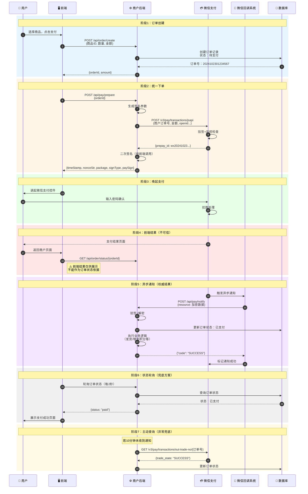
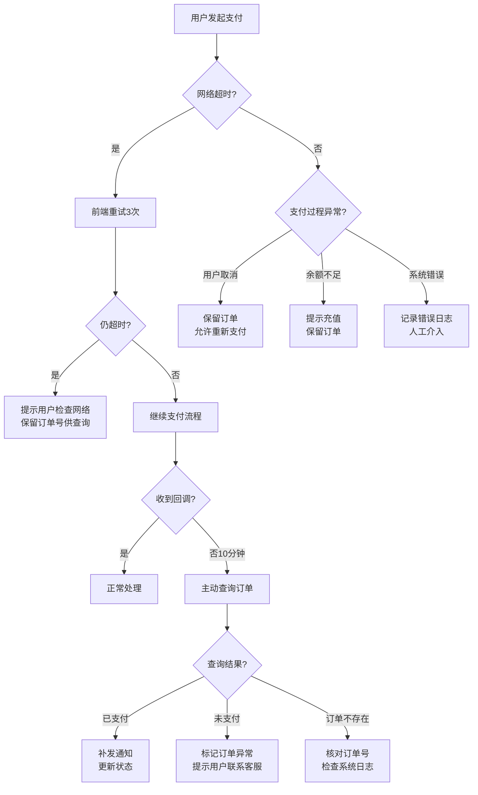
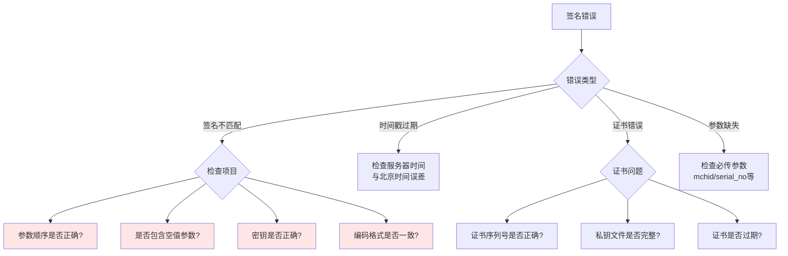
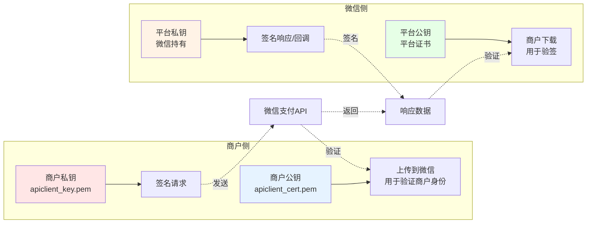
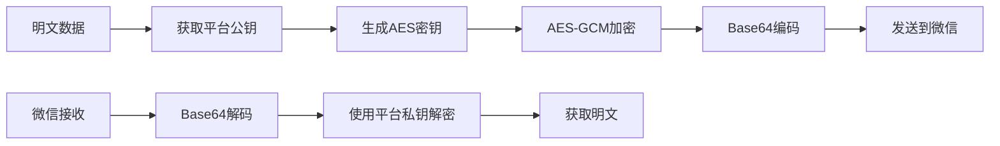
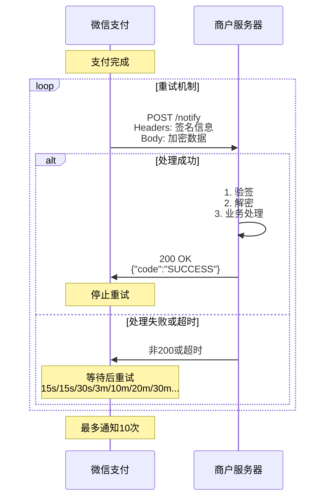
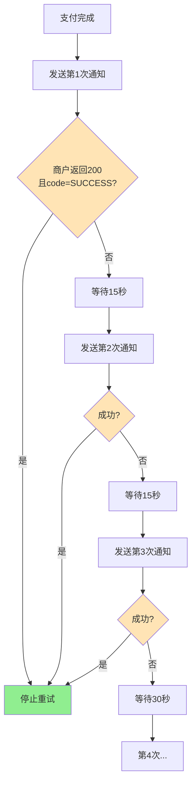
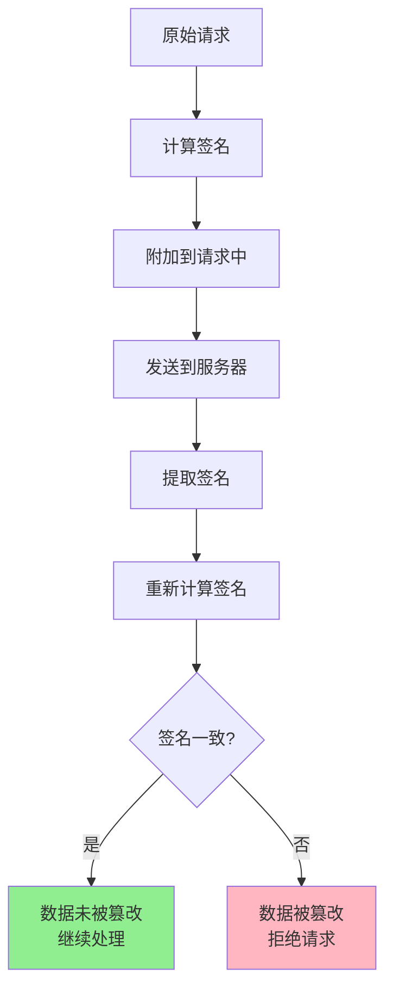

# 微信支付技术架构深度解析

## 📑 文档目录

1. [文档概述](#文档概述)
2. [完整交易流程详解](#完整交易流程详解)
   - [标准支付流程](#标准支付流程)
   - [关键节点分析](#关键节点分析)
   - [异常流程处理](#异常流程处理)
3. [签名算法实战](#签名算法实战)
   - [V2签名算法（MD5/HMAC-SHA256）](#v2签名算法)
   - [V3签名算法（SHA256-RSA2048）](#v3签名算法)
   - [签名验证实现](#签名验证实现)
   - [常见签名错误排查](#常见签名错误排查)
4. [证书体系深度解析](#证书体系深度解析)
   - [证书类型与作用](#证书类型与作用)
   - [证书获取与更新](#证书获取与更新)
   - [证书管理自动化](#证书管理自动化)
5. [敏感信息加密实战](#敏感信息加密实战)
   - [加密场景与算法](#加密场景与算法)
   - [加密实现代码](#加密实现代码)
   - [解密流程](#解密流程)
6. [回调机制与验签](#回调机制与验签)
   - [回调通知机制](#回调通知机制)
   - [验签流程实现](#验签流程实现)
   - [回调处理最佳实践](#回调处理最佳实践)
   - [重试机制与幂等设计](#重试机制与幂等设计)
7. [安全机制综合应用](#安全机制综合应用)
   - [防重放攻击](#防重放攻击)
   - [防篡改保护](#防篡改保护)
   - [密钥管理策略](#密钥管理策略)
8. [后续文档导航](#后续文档导航)

---

## 文档概述

**文档目标**：深入理解微信支付的技术架构，掌握签名算法、证书管理、加密解密等核心技术，为实际开发奠定坚实基础。

**适用场景**：
- 理解支付系统的安全机制
- 解决开发中的签名/验签问题
- 实现回调处理的最佳实践
- 学习证书管理自动化方案

**阅读时长**：约 30 分钟

**前置知识**：建议先阅读《文档1：微信支付全景认知与准备工作》

---

## 完整交易流程详解

### 标准支付流程

微信支付的完整流程包含7个关键阶段，下面我们通过详细的时序图和分步解析来理解：



---

### 关键节点分析

#### **节点1-5：订单创建**

**前端代码示例**（Vue3）：
```javascript
// 创建订单
async function createOrder() {
  try {
    const response = await axios.post('/api/order/create', {
      productId: 'PROD_001',
      quantity: 1,
      amount: 9900, // 单位：分（99元）
      description: '精品课程-Vue3实战'
    });
  
    const { orderId, amount } = response.data;
  
    // 立即发起支付
    await preparePayment(orderId);
  } catch (error) {
    console.error('订单创建失败:', error);
  }
}
```

**后端代码示例**（Node.js）：
```javascript
// 创建订单接口
app.post('/api/order/create', async (req, res) => {
  const { productId, quantity, amount, description } = req.body;

  // 1. 生成商户订单号（必须唯一）
  const outTradeNo = generateOrderNo(); // 例如：20241023123456789

  // 2. 保存订单到数据库
  await db.orders.create({
    outTradeNo,
    productId,
    quantity,
    amount,
    description,
    status: 'PENDING', // 待支付
    userId: req.user.id,
    createdAt: new Date()
  });

  res.json({
    orderId: outTradeNo,
    amount
  });
});

// 订单号生成规则
function generateOrderNo() {
  const date = new Date();
  const dateStr = date.toISOString().replace(/[-T:\.Z]/g, '').slice(0, 14);
  const random = Math.random().toString(36).substr(2, 9).toUpperCase();
  return `${dateStr}${random}`; // 例如：20241023103045ABC123DEF
}
```

> **💡 设计要点**：
> - 订单号必须全局唯一，建议包含时间戳+随机数
> - 金额单位统一为**分**，避免浮点数精度问题
> - 订单创建和支付分离，支持用户多次尝试支付

---

#### **节点6-12：统一下单**

这是整个流程中最复杂的环节，涉及签名生成、参数组装等。

**后端实现**（Node.js + V3 API）：
```javascript
const axios = require('axios');
const crypto = require('crypto');
const fs = require('fs');

// 统一下单接口
app.post('/api/pay/prepare', async (req, res) => {
  const { orderId } = req.body;

  // 1. 查询订单信息
  const order = await db.orders.findOne({ outTradeNo: orderId });
  if (!order) {
    return res.status(404).json({ error: '订单不存在' });
  }

  // 2. 获取用户openid（JSAPI支付必需）
  const openid = req.user.openid; // 从session/token中获取

  // 3. 组装请求参数
  const params = {
    appid: config.appId,
    mchid: config.mchId,
    description: order.description,
    out_trade_no: order.outTradeNo,
    notify_url: config.notifyUrl,
    amount: {
      total: order.amount,
      currency: 'CNY'
    },
    payer: {
      openid: openid
    }
  };

  // 4. 生成签名并调用微信API
  const prepayId = await unifiedOrder(params);

  // 5. 生成前端调起支付所需参数
  const paymentParams = generatePaymentParams(prepayId);

  res.json(paymentParams);
});

// 调用微信统一下单API
async function unifiedOrder(params) {
  const url = 'https://api.mch.weixin.qq.com/v3/pay/transactions/jsapi';
  const method = 'POST';
  const body = JSON.stringify(params);

  // 生成签名
  const signature = generateSignature(method, url, body);

  try {
    const response = await axios.post(url, body, {
      headers: {
        'Content-Type': 'application/json',
        'Authorization': buildAuthHeader(signature),
        'User-Agent': 'MyMerchant/1.0'
      }
    });
  
    return response.data.prepay_id;
  } catch (error) {
    console.error('统一下单失败:', error.response?.data);
    throw new Error('支付准备失败');
  }
}

// 生成V3签名（详细实现见下一节）
function generateSignature(method, url, body) {
  const timestamp = Math.floor(Date.now() / 1000);
  const nonceStr = crypto.randomBytes(16).toString('hex');
  const urlObj = new URL(url);
  const urlPath = urlObj.pathname + urlObj.search;

  // 构造签名串
  const signStr = `${method}\n${urlPath}\n${timestamp}\n${nonceStr}\n${body}\n`;

  // 使用商户私钥签名
  const privateKey = fs.readFileSync(config.privateKeyPath);
  const sign = crypto.createSign('RSA-SHA256');
  sign.update(signStr);
  const signature = sign.sign(privateKey, 'base64');

  return {
    timestamp,
    nonceStr,
    signature
  };
}

// 构造Authorization头
function buildAuthHeader({ timestamp, nonceStr, signature }) {
  return `WECHATPAY2-SHA256-RSA2048 mchid="${config.mchId}",nonce_str="${nonceStr}",signature="${signature}",timestamp="${timestamp}",serial_no="${config.serialNo}"`;
}

// 生成前端调起支付的参数
function generatePaymentParams(prepayId) {
  const timestamp = Math.floor(Date.now() / 1000).toString();
  const nonceStr = crypto.randomBytes(16).toString('hex');
  const packageStr = `prepay_id=${prepayId}`;

  // 二次签名（供前端使用）
  const signStr = `${config.appId}\n${timestamp}\n${nonceStr}\n${packageStr}\n`;
  const sign = crypto.createSign('RSA-SHA256');
  sign.update(signStr);
  const paySign = sign.sign(fs.readFileSync(config.privateKeyPath), 'base64');

  return {
    timeStamp: timestamp,
    nonceStr,
    package: packageStr,
    signType: 'RSA',
    paySign
  };
}
```

**前端调起支付**（Vue3 + 小程序）：
```javascript
// 小程序支付
async function payInMiniProgram(orderId) {
  try {
    // 1. 获取支付参数
    const payParams = await axios.post('/api/pay/prepare', { orderId });
  
    // 2. 调起微信支付
    const result = await new Promise((resolve, reject) => {
      wx.requestPayment({
        timeStamp: payParams.timeStamp,
        nonceStr: payParams.nonceStr,
        package: payParams.package,
        signType: payParams.signType,
        paySign: payParams.paySign,
        success: resolve,
        fail: reject
      });
    });
  
    console.log('支付成功（前端结果）:', result);
  
    // 3. 轮询订单状态（不能直接信任前端结果）
    await pollOrderStatus(orderId);
  
  } catch (error) {
    if (error.errMsg.includes('cancel')) {
      console.log('用户取消支付');
    } else {
      console.error('支付失败:', error);
    }
  }
}

// 轮询订单状态
async function pollOrderStatus(orderId, maxAttempts = 30) {
  for (let i = 0; i < maxAttempts; i++) {
    await new Promise(resolve => setTimeout(resolve, 2000)); // 等待2秒
  
    const order = await axios.get(`/api/order/status/${orderId}`);
  
    if (order.data.status === 'PAID') {
      console.log('支付确认成功');
      // 跳转到成功页面
      wx.redirectTo({ url: '/pages/order/success?orderId=' + orderId });
      return;
    }
  }

  console.warn('支付状态确认超时，请手动查询订单');
}
```

---

#### **节点18-23：异步通知处理**

这是确认订单状态的**权威来源**，必须严格验签并保证幂等性。

**后端回调处理**：
```javascript
const crypto = require('crypto');

// 支付回调接口
app.post('/api/pay/notify', async (req, res) => {
  try {
    // 1. 验证签名
    const isValid = await verifyNotifySignature(req);
    if (!isValid) {
      console.error('回调签名验证失败');
      return res.status(401).json({ code: 'FAIL', message: '签名验证失败' });
    }
  
    // 2. 解密resource数据
    const resource = req.body.resource;
    const decryptedData = decryptResource(resource);
    const paymentData = JSON.parse(decryptedData);
  
    console.log('支付回调数据:', paymentData);
  
    // 3. 幂等性检查（防止重复处理）
    const outTradeNo = paymentData.out_trade_no;
    const order = await db.orders.findOne({ outTradeNo });
  
    if (order.status === 'PAID') {
      console.log('订单已处理，跳过重复通知');
      return res.json({ code: 'SUCCESS' });
    }
  
    // 4. 验证金额
    if (order.amount !== paymentData.amount.total) {
      console.error('金额不匹配');
      return res.status(400).json({ code: 'FAIL', message: '金额异常' });
    }
  
    // 5. 更新订单状态（使用事务）
    await db.transaction(async (trx) => {
      await db.orders.update(
        { outTradeNo },
        {
          status: 'PAID',
          transactionId: paymentData.transaction_id,
          paidAt: new Date(paymentData.success_time)
        },
        { transaction: trx }
      );
    
      // 6. 执行业务逻辑
      await executeBusinessLogic(order, trx);
    });
  
    // 7. 返回成功应答（必须！）
    res.json({ code: 'SUCCESS' });
  
  } catch (error) {
    console.error('回调处理异常:', error);
    res.status(500).json({ code: 'FAIL', message: error.message });
  }
});

// 验证回调签名
async function verifyNotifySignature(req) {
  const signature = req.headers['wechatpay-signature'];
  const timestamp = req.headers['wechatpay-timestamp'];
  const nonce = req.headers['wechatpay-nonce'];
  const body = JSON.stringify(req.body);

  // 构造验签串
  const signStr = `${timestamp}\n${nonce}\n${body}\n`;

  // 获取微信平台证书公钥
  const publicKey = await getPlatformPublicKey();

  // 验签
  const verify = crypto.createVerify('RSA-SHA256');
  verify.update(signStr);
  return verify.verify(publicKey, signature, 'base64');
}

// 解密resource数据
function decryptResource(resource) {
  const { ciphertext, associated_data, nonce } = resource;

  // AES-256-GCM解密
  const decipher = crypto.createDecipheriv(
    'aes-256-gcm',
    config.v3Key, // APIv3密钥
    nonce
  );

  decipher.setAuthTag(Buffer.from(resource.tag || '', 'base64'));
  decipher.setAAD(Buffer.from(associated_data));

  let decrypted = decipher.update(ciphertext, 'base64', 'utf8');
  decrypted += decipher.final('utf8');

  return decrypted;
}

// 执行业务逻辑
async function executeBusinessLogic(order, trx) {
  // 示例：增加用户积分
  await db.users.increment(
    { id: order.userId },
    { points: Math.floor(order.amount / 100) },
    { transaction: trx }
  );

  // 示例：发送支付成功通知
  await sendNotification(order.userId, {
    type: 'PAYMENT_SUCCESS',
    orderId: order.outTradeNo,
    amount: order.amount
  });

  // 示例：如果是虚拟商品，自动发货
  if (order.productType === 'VIRTUAL') {
    await deliverVirtualProduct(order, trx);
  }
}
```

> **⚠️ 关键注意事项**：
> 1. **必须验签**：拒绝所有验签失败的请求
> 2. **幂等设计**：支付成功的订单不能重复处理
> 3. **快速响应**：业务逻辑建议异步处理，回调接口应在5秒内返回
> 4. **返回格式**：必须返回`{"code": "SUCCESS"}`，否则微信会持续重试
> 5. **异常处理**：返回非200状态码，微信会按照固定频率重试（15s/15s/30s/3m/10m/20m/30m/30m...最多通知10次）

---

### 异常流程处理



**主动查询订单实现**：
```javascript
// 定时任务：检查长时间未收到回调的订单
async function checkPendingOrders() {
  const tenMinutesAgo = new Date(Date.now() - 10 * 60 * 1000);

  // 查询10分钟前创建但仍未支付的订单
  const pendingOrders = await db.orders.find({
    status: 'PENDING',
    createdAt: { $lt: tenMinutesAgo }
  });

  for (const order of pendingOrders) {
    try {
      // 调用微信查单接口
      const result = await queryOrder(order.outTradeNo);
    
      if (result.trade_state === 'SUCCESS') {
        // 支付成功但未收到回调，补单处理
        await processPaymentSuccess(order, result);
        console.log(`订单${order.outTradeNo}补单成功`);
      } else if (result.trade_state === 'CLOSED' || result.trade_state === 'PAYERROR') {
        // 订单关闭或支付失败
        await db.orders.update(
          { outTradeNo: order.outTradeNo },
          { status: 'CLOSED', closedAt: new Date() }
        );
      }
      // 其他状态（如NOTPAY）继续等待
    } catch (error) {
      console.error(`查询订单${order.outTradeNo}失败:`, error);
    }
  }
}

// 查询订单接口
async function queryOrder(outTradeNo) {
  const url = `https://api.mch.weixin.qq.com/v3/pay/transactions/out-trade-no/${outTradeNo}`;
  const method = 'GET';

  const signature = generateSignature(method, url, '');

  const response = await axios.get(url, {
    headers: {
      'Authorization': buildAuthHeader(signature),
      'Accept': 'application/json'
    },
    params: {
      mchid: config.mchId
    }
  });

  return response.data;
}

// 定时执行（每分钟）
setInterval(checkPendingOrders, 60 * 1000);
```

---

## 签名算法实战

签名是微信支付安全机制的核心，分为V2和V3两套算法。

### V2签名算法

> **📌 说明**：V2已逐步淘汰，但部分接口（如退款、红包）仍在使用。

**签名步骤**：
1. 参数按ASCII码升序排序
2. 拼接成`key=value`格式
3. 末尾追加`&key=商户密钥`
4. 进行MD5或HMAC-SHA256

**完整实现**：
```javascript
const crypto = require('crypto');

// V2签名生成
function generateV2Signature(params, signType = 'HMAC-SHA256') {
  // 1. 过滤空值参数
  const filteredParams = Object.keys(params)
    .filter(key => params[key] !== '' && params[key] !== undefined)
    .reduce((obj, key) => {
      obj[key] = params[key];
      return obj;
    }, {});

  // 2. 按键名ASCII码升序排序
  const sortedKeys = Object.keys(filteredParams).sort();

  // 3. 拼接成 key=value& 格式
  const stringA = sortedKeys
    .map(key => `${key}=${filteredParams[key]}`)
    .join('&');

  // 4. 追加密钥
  const stringSignTemp = `${stringA}&key=${config.v2Key}`;

  // 5. 计算签名
  let signature;
  if (signType === 'MD5') {
    signature = crypto.createHash('md5').update(stringSignTemp, 'utf8').digest('hex');
  } else { // HMAC-SHA256
    signature = crypto.createHmac('sha256', config.v2Key).update(stringSignTemp, 'utf8').digest('hex');
  }

  return signature.toUpperCase();
}

// 使用示例
const params = {
  appid: 'wx1234567890abcdef',
  mch_id: '1234567890',
  nonce_str: 'ibuaiVcKdpRxkhJA',
  out_trade_no: '20241023123456',
  total_fee: 9900,
  sign_type: 'HMAC-SHA256'
};

const sign = generateV2Signature(params);
console.log('V2签名:', sign);
// 输出：6A9AE1657590FD5B2A0DCADC7B0AFE0B
```

**验签示例**：
```javascript
// V2验签
function verifyV2Signature(params) {
  const receivedSign = params.sign;
  const signType = params.sign_type || 'MD5';

  // 移除sign字段
  const paramsWithoutSign = { ...params };
  delete paramsWithoutSign.sign;

  // 重新计算签名
  const calculatedSign = generateV2Signature(paramsWithoutSign, signType);

  return receivedSign === calculatedSign;
}
```

---

### V3签名算法

**签名步骤**：
1. 构造签名串（包含HTTP方法、URL、时间戳、随机数、请求体）
2. 使用商户私钥进行SHA256-RSA2048签名
3. Base64编码
4. 放入Authorization头

**完整实现**：
```javascript
const crypto = require('crypto');
const fs = require('fs');

// V3签名生成（请求时使用）
function generateV3Signature(method, url, body = '') {
  const timestamp = Math.floor(Date.now() / 1000);
  const nonceStr = crypto.randomBytes(16).toString('hex');

  // 解析URL
  const urlObj = new URL(url);
  const urlPath = urlObj.pathname + urlObj.search; // 包含query参数

  // 构造签名串（每部分以\n分隔）
  const signStr = [
    method.toUpperCase(),
    urlPath,
    timestamp,
    nonceStr,
    body // 如果是GET请求，body为空字符串
  ].join('\n') + '\n'; // 注意末尾也有\n

  console.log('待签名字符串:\n', signStr);

  // 读取商户私钥
  const privateKey = fs.readFileSync(config.privateKeyPath, 'utf8');

  // 使用私钥签名
  const sign = crypto.createSign('RSA-SHA256');
  sign.update(signStr);
  const signature = sign.sign(privateKey, 'base64');

  return {
    timestamp,
    nonceStr,
    signature
  };
}

// 构造Authorization头
function buildV3AuthHeader(method, url, body = '') {
  const { timestamp, nonceStr, signature } = generateV3Signature(method, url, body);

  return `WECHATPAY2-SHA256-RSA2048 mchid="${config.mchId}",nonce_str="${nonceStr}",signature="${signature}",timestamp="${timestamp}",serial_no="${config.serialNo}"`;
}

// 使用示例
const url = 'https://api.mch.weixin.qq.com/v3/pay/transactions/jsapi';
const method = 'POST';
const body = JSON.stringify({
  appid: config.appId,
  mchid: config.mch
  继续生成文档2的剩余内容...

---

```javascript
// 使用示例（接上文）
const url = 'https://api.mch.weixin.qq.com/v3/pay/transactions/jsapi';
const method = 'POST';
const body = JSON.stringify({
  appid: config.appId,
  mchid: config.mchId,
  description: '测试商品',
  out_trade_no: '20241023123456',
  notify_url: config.notifyUrl,
  amount: {
    total: 100,
    currency: 'CNY'
  }
});

const authHeader = buildV3AuthHeader(method, url, body);
console.log('Authorization:', authHeader);
```

**V3验签实现**（验证微信返回/回调的签名）：
```javascript
const crypto = require('crypto');

// V3验签（接收微信响应/回调时使用）
function verifyV3Signature(timestamp, nonce, body, signature) {
  // 1. 构造验签串
  const signStr = [
    timestamp,
    nonce,
    body
  ].join('\n') + '\n';

  console.log('验签字符串:\n', signStr);

  // 2. 获取微信平台证书公钥
  const publicKey = getPlatformPublicKey();

  // 3. 验证签名
  const verify = crypto.createVerify('RSA-SHA256');
  verify.update(signStr);

  return verify.verify(publicKey, signature, 'base64');
}

// 从HTTP头中提取并验签（Express中间件）
function verifyWechatSignatureMiddleware(req, res, next) {
  const signature = req.headers['wechatpay-signature'];
  const timestamp = req.headers['wechatpay-timestamp'];
  const nonce = req.headers['wechatpay-nonce'];
  const body = JSON.stringify(req.body);

  // 防重放攻击：检查时间戳
  const now = Math.floor(Date.now() / 1000);
  if (Math.abs(now - timestamp) > 300) { // 5分钟
    return res.status(401).json({ code: 'FAIL', message: '请求已过期' });
  }

  // 验签
  const isValid = verifyV3Signature(timestamp, nonce, body, signature);

  if (!isValid) {
    console.error('签名验证失败');
    return res.status(401).json({ code: 'FAIL', message: '签名验证失败' });
  }

  next();
}

// 在回调路由中使用
app.post('/api/pay/notify', verifyWechatSignatureMiddleware, async (req, res) => {
  // 签名已验证，处理业务逻辑
  // ...
});
```

---

### 签名验证实现

**完整的签名测试工具**：
```javascript
// 签名调试工具
class SignatureTester {
  // 测试V2签名
  static testV2() {
    const params = {
      appid: 'wx1234567890abcdef',
      mch_id: '1234567890',
      nonce_str: 'test123456',
      out_trade_no: 'TEST20241023001',
      total_fee: 100
    };
  
    console.log('V2签名测试');
    console.log('原始参数:', params);
  
    const signature = generateV2Signature(params);
    console.log('生成签名:', signature);
  
    // 验证
    params.sign = signature;
    const isValid = verifyV2Signature(params);
    console.log('验签结果:', isValid ? '✅ 通过' : '❌ 失败');
  }

  // 测试V3签名
  static testV3() {
    const method = 'POST';
    const url = 'https://api.mch.weixin.qq.com/v3/pay/transactions/jsapi';
    const body = '{"test":"data"}';
  
    console.log('\nV3签名测试');
    console.log('请求方法:', method);
    console.log('请求URL:', url);
    console.log('请求体:', body);
  
    const { timestamp, nonceStr, signature } = generateV3Signature(method, url, body);
    console.log('时间戳:', timestamp);
    console.log('随机串:', nonceStr);
    console.log('签名:', signature);
  
    // 模拟验签
    const signStr = `${method}\n/v3/pay/transactions/jsapi\n${timestamp}\n${nonceStr}\n${body}\n`;
    console.log('签名原文:\n', signStr);
  }

  // 对比两次签名
  static compareSignatures(params) {
    const sign1 = generateV2Signature(params);
    const sign2 = generateV2Signature(params);
  
    console.log('\n签名一致性测试');
    console.log('第一次:', sign1);
    console.log('第二次:', sign2);
    console.log('结果:', sign1 === sign2 ? '✅ 一致' : '❌ 不一致（检查随机数）');
  }
}

// 运行测试
SignatureTester.testV2();
SignatureTester.testV3();
```

---

### 常见签名错误排查



**排查清单**：

| 问题 | 排查方法 | 解决方案 |
|------|---------|---------|
| **V2签名失败** | 打印待签名字符串 | 1. 检查参数排序<br/>2. 移除sign字段<br/>3. 确认密钥正确 |
| **V3签名失败** | 打印签名原文 | 1. 检查URL路径（含query）<br/>2. 确认时间戳格式（秒级）<br/>3. 验证私钥文件路径 |
| **时间戳过期** | 对比服务器与北京时间 | 使用NTP同步服务器时间 |
| **证书序列号错误** | 检查证书文件 | 重新下载证书<br/>提取序列号 |
| **编码问题** | 检查字符编码 | 统一使用UTF-8 |

**调试代码**：
```javascript
// 签名调试辅助函数
function debugSignature(params, expectedSign) {
  console.log('========== 签名调试 ==========');

  // 1. 打印原始参数
  console.log('1. 原始参数:');
  console.log(JSON.stringify(params, null, 2));

  // 2. 打印排序后的键
  const sortedKeys = Object.keys(params).sort();
  console.log('\n2. 排序后的键:', sortedKeys);

  // 3. 打印待签名字符串
  const stringA = sortedKeys
    .filter(key => params[key] !== '' && key !== 'sign')
    .map(key => `${key}=${params[key]}`)
    .join('&');
  console.log('\n3. 待签名字符串（不含key）:');
  console.log(stringA);

  // 4. 计算签名
  const calculatedSign = generateV2Signature(params);
  console.log('\n4. 计算的签名:', calculatedSign);
  console.log('5. 期望的签名:', expectedSign);

  // 5. 对比结果
  const isMatch = calculatedSign === expectedSign;
  console.log('\n6. 验签结果:', isMatch ? '✅ 匹配' : '❌ 不匹配');

  if (!isMatch) {
    console.log('\n差异分析:');
    console.log(`长度: 计算=${calculatedSign.length}, 期望=${expectedSign.length}`);
    for (let i = 0; i < Math.max(calculatedSign.length, expectedSign.length); i++) {
      if (calculatedSign[i] !== expectedSign[i]) {
        console.log(`位置${i}: 计算='${calculatedSign[i]}', 期望='${expectedSign[i]}'`);
      }
    }
  }

  console.log('================================\n');
}
```

---

## 证书体系深度解析

### 证书类型与作用

微信支付使用PKI体系，涉及三种证书：



**详细说明**：

| 证书 | 文件名 | 用途 | 持有方 | 更新频率 |
|------|--------|------|--------|---------|
| **商户私钥** | apiclient_key.pem | 签名请求参数 | 商户服务器 | 手动，建议每年 |
| **商户证书** | apiclient_cert.pem | 包含商户公钥 | 上传到微信 | 与私钥同步 |
| **平台证书** | wechatpay_SERIAL.pem | 验证微信返回/回调 | 商户服务器 | 自动，有效期1年 |

---

### 证书获取与更新

**1. 商户证书获取**

登录微信支付商户平台：
```
账户中心 → API安全 → 申请API证书
```

下载后得到压缩包，包含三个文件：
- `apiclient_cert.pem` - 商户证书（公钥）
- `apiclient_key.pem` - 商户私钥
- `apiclient_cert.p12` - PKCS12格式证书（Java使用）

**提取证书序列号**：
```bash
# 方法1：使用openssl
openssl x509 -in apiclient_cert.pem -noout -serial

# 输出示例：
# serial=5E4A3B2C1D0F9E8A7B6C5D4E3F2A1B0C

# 方法2：在商户平台查看
# 账户中心 → API安全 → 查看证书 → 证书序列号
```

**2. 平台证书获取**

平台证书必须通过API动态获取：

```javascript
const axios = require('axios');
const crypto = require('crypto');
const fs = require('fs');

// 获取平台证书
async function downloadPlatformCertificate() {
  const url = 'https://api.mch.weixin.qq.com/v3/certificates';
  const method = 'GET';

  // 1. 生成签名
  const { timestamp, nonceStr, signature } = generateV3Signature(method, url, '');

  try {
    // 2. 请求证书列表
    const response = await axios.get(url, {
      headers: {
        'Authorization': buildV3AuthHeader(method, url, ''),
        'Accept': 'application/json'
      }
    });
  
    const certificates = response.data.data;
    console.log(`获取到${certificates.length}个平台证书`);
  
    // 3. 解密证书内容
    for (const cert of certificates) {
      const decryptedCert = decryptCertificate(cert.encrypt_certificate);
    
      // 4. 保存证书到本地
      const filename = `wechatpay_${cert.serial_no}.pem`;
      fs.writeFileSync(filename, decryptedCert);
    
      console.log(`证书已保存: ${filename}`);
      console.log(`序列号: ${cert.serial_no}`);
      console.log(`生效时间: ${cert.effective_time}`);
      console.log(`过期时间: ${cert.expire_time}`);
    
      // 5. 缓存到内存
      platformCertCache.set(cert.serial_no, {
        publicKey: decryptedCert,
        expireTime: new Date(cert.expire_time)
      });
    }
  
    return certificates;
  } catch (error) {
    console.error('获取平台证书失败:', error.response?.data || error.message);
    throw error;
  }
}

// 解密证书内容
function decryptCertificate(encryptCert) {
  const { algorithm, nonce, associated_data, ciphertext } = encryptCert;

  if (algorithm !== 'AEAD_AES_256_GCM') {
    throw new Error(`不支持的加密算法: ${algorithm}`);
  }

  // 使用APIv3密钥解密
  const decipher = crypto.createDecipheriv(
    'aes-256-gcm',
    config.v3Key,
    nonce
  );

  decipher.setAuthTag(Buffer.from(ciphertext.slice(-16), 'base64'));
  decipher.setAAD(Buffer.from(associated_data));

  let decrypted = decipher.update(ciphertext.slice(0, -16), 'base64', 'utf8');
  decrypted += decipher.final('utf8');

  return decrypted;
}

// 内存缓存
const platformCertCache = new Map();

// 获取有效的平台公钥
function getPlatformPublicKey(serialNo = null) {
  if (serialNo) {
    const cert = platformCertCache.get(serialNo);
    if (cert && cert.expireTime > new Date()) {
      return cert.publicKey;
    }
  }

  // 返回最新的有效证书
  const validCerts = Array.from(platformCertCache.values())
    .filter(cert => cert.expireTime > new Date())
    .sort((a, b) => b.expireTime - a.expireTime);

  if (validCerts.length === 0) {
    throw new Error('没有有效的平台证书，请重新下载');
  }

  return validCerts[0].publicKey;
}
```

---

### 证书管理自动化

**完整的证书管理系统**：

```javascript
class CertificateManager {
  constructor() {
    this.certCache = new Map();
    this.updateInterval = null;
  }

  // 初始化证书管理器
  async initialize() {
    console.log('初始化证书管理器...');
  
    // 1. 加载本地证书（如果有）
    await this.loadLocalCertificates();
  
    // 2. 检查并更新证书
    await this.updateCertificates();
  
    // 3. 启动定时任务（每12小时检查一次）
    this.startAutoUpdate();
  
    console.log('证书管理器初始化完成');
  }

  // 加载本地保存的证书
  async loadLocalCertificates() {
    try {
      const files = fs.readdirSync('./certs');
      const certFiles = files.filter(f => f.startsWith('wechatpay_') && f.endsWith('.pem'));
    
      for (const file of certFiles) {
        const serialNo = file.replace('wechatpay_', '').replace('.pem', '');
        const content = fs.readFileSync(`./certs/${file}`, 'utf8');
      
        // 提取证书有效期
        const cert = crypto.X509Certificate(content);
        const expireTime = new Date(cert.validTo);
      
        this.certCache.set(serialNo, {
          publicKey: content,
          expireTime
        });
      
        console.log(`加载证书: ${serialNo}, 过期时间: ${expireTime.toISOString()}`);
      }
    } catch (error) {
      console.log('没有本地证书，将从API获取');
    }
  }

  // 更新证书
  async updateCertificates() {
    try {
      const certificates = await downloadPlatformCertificate();
    
      // 清理过期证书文件
      this.cleanExpiredCertificates();
    
      return certificates;
    } catch (error) {
      console.error('更新证书失败:', error);
    
      // 如果有缓存，继续使用
      if (this.certCache.size > 0) {
        console.log('使用缓存的证书继续运行');
      } else {
        throw new Error('无可用证书，系统无法启动');
      }
    }
  }

  // 清理过期证书
  cleanExpiredCertificates() {
    const now = new Date();
  
    for (const [serialNo, cert] of this.certCache.entries()) {
      if (cert.expireTime < now) {
        console.log(`清理过期证书: ${serialNo}`);
        this.certCache.delete(serialNo);
      
        // 删除文件
        try {
          fs.unlinkSync(`./certs/wechatpay_${serialNo}.pem`);
        } catch (e) {
          console.error(`删除证书文件失败: ${e.message}`);
        }
      }
    }
  }

  // 启动自动更新
  startAutoUpdate() {
    // 每12小时检查一次
    this.updateInterval = setInterval(async () => {
      console.log('定时检查证书更新...');
      await this.updateCertificates();
    }, 12 * 60 * 60 * 1000);
  }

  // 获取证书
  getCertificate(serialNo = null) {
    return getPlatformPublicKey(serialNo);
  }

  // 停止管理器
  stop() {
    if (this.updateInterval) {
      clearInterval(this.updateInterval);
      console.log('证书管理器已停止');
    }
  }
}

// 全局单例
const certManager = new CertificateManager();

// 在应用启动时初始化
async function startApplication() {
  await certManager.initialize();

  // 启动Express服务器
  app.listen(3000, () => {
    console.log('服务器启动成功');
  });
}

// 优雅关闭
process.on('SIGTERM', () => {
  certManager.stop();
  process.exit(0);
});

startApplication();
```

**证书更新监控**：
```javascript
// 证书预警系统
class CertificateMonitor {
  // 检查证书是否即将过期
  static checkExpiration() {
    const warningDays = 30; // 30天预警
    const now = new Date();
  
    for (const [serialNo, cert] of certManager.certCache.entries()) {
      const daysUntilExpire = Math.floor(
        (cert.expireTime - now) / (1000 * 60 * 60 * 24)
      );
    
      if (daysUntilExpire <= warningDays) {
        console.warn(`⚠️  证书${serialNo}将在${daysUntilExpire}天后过期`);
      
        // 发送告警
        this.sendAlert({
          type: 'CERT_EXPIRING',
          serialNo,
          daysLeft: daysUntilExpire,
          expireTime: cert.expireTime
        });
      }
    }
  }

  // 发送告警（示例）
  static async sendAlert(alert) {
    // 可以发送邮件、钉钉、企业微信等
    console.log('发送告警:', JSON.stringify(alert, null, 2));
  
    // 示例：发送到监控系统
    try {
      await axios.post('https://monitor.example.com/alert', alert);
    } catch (error) {
      console.error('告警发送失败:', error.message);
    }
  }
}

// 每天检查一次
setInterval(() => {
  CertificateMonitor.checkExpiration();
}, 24 * 60 * 60 * 1000);
```

---

## 敏感信息加密实战

### 加密场景与算法

**需要加密的敏感信息**：
- 用户姓名
- 身份证号
- 银行卡号
- 手机号码
- 地址信息

**加密算法**：AES-256-GCM（Galois/Counter Mode）



### 加密实现代码

```javascript
const crypto = require('crypto');

// 敏感信息加密
function encryptSensitiveData(plaintext) {
  // 1. 获取平台证书公钥
  const publicKey = certManager.getCertificate();

  // 2. 生成随机AES密钥
  const aesKey = crypto.randomBytes(32); // 256位

  // 3. 生成随机IV
  const iv = crypto.randomBytes(12); // GCM模式推荐12字节

  // 4. AES-GCM加密
  const cipher = crypto.createCipheriv('aes-256-gcm', aesKey, iv);
  let encrypted = cipher.update(plaintext, 'utf8', 'base64');
  encrypted += cipher.final('base64');

  // 5. 获取认证标签
  const authTag = cipher.getAuthTag();

  // 6. 使用平台公钥加密AES密钥
  const encryptedKey = crypto.publicEncrypt(
    {
      key: publicKey,
      padding: crypto.constants.RSA_PKCS1_OAEP_PADDING,
      oaepHash: 'sha256'
    },
    aesKey
  );

  // 7. 返回加密结果
  return {
    algorithm: 'AEAD_AES_256_GCM',
    ciphertext: Buffer.concat([
      Buffer.from(encrypted, 'base64'),
      authTag
    ]).toString('base64'),
    nonce: iv.toString('base64'),
    associated_data: '', // 可选的关联数据
    encrypted_key: encryptedKey.toString('base64')
  };
}

// 使用示例
const sensitiveInfo = {
  name: '张三',
  id_card_number: '110101199001011234',
  mobile: '13800138000'
};

const encrypted = encryptSensitiveData(JSON.stringify(sensitiveInfo));
console.log('加密结果:', encrypted);

// 在API请求中使用
const requestData = {
  appid: config.appId,
  mchid: config.mchId,
  payer_info: encrypted, // 敏感信息已加密
  // ... 其他参数
};
```

### 解密流程

```javascript
// 解密回调中的敏感信息
function decryptCallbackResource(resource) {
  const { ciphertext, associated_data, nonce } = resource;

  // 使用APIv3密钥解密
  const decipher = crypto.createDecipheriv(
    'aes-256-gcm',
    config.v3Key,
    Buffer.from(nonce, 'base64')
  );

  // 设置关联数据
  if (associated_data) {
    decipher.setAAD(Buffer.from(associated_data));
  }

  // 提取认证标签（最后16字节）
  const ciphertextBuffer = Buffer.from(ciphertext, 'base64');
  const authTag = ciphertextBuffer.slice(-16);
  const encryptedData = ciphertextBuffer.slice(0, -16);

  decipher.setAuthTag(authTag);

  // 解密
  let decrypted = decipher.update(encryptedData, null, 'utf8');
  decrypted += decipher.final('utf8');

  return JSON.parse(decrypted);
}
```

---

## 回调机制与验签

### 回调通知机制

微信支付通过HTTP POST方式发送支付结果通知：



**重试时间间隔**：
```
15秒 → 15秒 → 30秒 → 3分钟 → 10分钟 → 20分钟 → 30分钟 → 30分钟 → 30分钟 → 30分钟
```

### 验签流程实现

**完整的回调处理实现**：
```javascript
const express = require('express');
const crypto = require('crypto');

// 回调路由
app.post('/api/pay/notify', async (req, res) => {
  const startTime = Date.now();

  try {
    // ============= 第一步：验证签名 =============
    const signature = req.headers['wechatpay-signature'];
    const timestamp = req.headers['wechatpay-timestamp'];
    const nonce = req.headers['wechatpay-nonce'];
    const serialNo = req.headers['wechatpay-serial'];
    const body = JSON.stringify(req.body);
  
    console.log(`[回调] 收到通知, 商户订单号: ${req.body.out_trade_no || 'unknown'}`);
  
    // 防重放攻击
    const now = Math.floor(Date.now() / 1000);
    if (Math.abs(now - timestamp) > 300) {
      console.error('[回调] 请求时间戳过期');
      return res.status(401).json({ code: 'FAIL', message: '请求已过期' });
    }
  
    // 验签
    const isValid = verifyNotifySignature(timestamp, nonce, body, signature, serialNo);
    if (!isValid) {
      console.error('[回调] 签名验证失败');
      return res.status(401).json({ code: 'FAIL', message: '签名验证失败' });
    }
  
    console.log('[回调] 签名验证通过');
  
    // ============= 第二步：解密数据 =============
    const resource = req.body.resource;
    const decryptedData = decryptCallbackResource(resource);
    const paymentData = JSON.parse(decryptedData);
  
    console.log('[回调] 解密数据:', {
      out_trade_no: paymentData.out_trade_no,
      transaction_id: paymentData.transaction_id,
      trade_state: paymentData.trade_state,
      amount: paymentData.amount
    });
  
    // ============= 第三步：业务处理 =============
    const result = await processPaymentNot
    继续生成文档2的剩余内容...

---

```javascript
    // ============= 第三步：业务处理 =============
    const result = await processPaymentNotification(paymentData);
  
    if (!result.success) {
      console.error('[回调] 业务处理失败:', result.error);
      return res.status(500).json({ code: 'FAIL', message: result.error });
    }
  
    // ============= 第四步：返回成功应答 =============
    const processingTime = Date.now() - startTime;
    console.log(`[回调] 处理完成，耗时: ${processingTime}ms`);
  
    res.json({ code: 'SUCCESS', message: '成功' });
  
  } catch (error) {
    console.error('[回调] 异常:', error);
    res.status(500).json({ code: 'FAIL', message: error.message });
  }
});

// 业务处理函数
async function processPaymentNotification(paymentData) {
  const {
    out_trade_no,
    transaction_id,
    trade_state,
    trade_state_desc,
    amount,
    payer,
    success_time
  } = paymentData;

  try {
    // 1. 查询订单
    const order = await db.orders.findOne({ outTradeNo: out_trade_no });
  
    if (!order) {
      return { success: false, error: '订单不存在' };
    }
  
    // 2. 幂等性检查
    if (order.status === 'PAID') {
      console.log('[回调] 订单已处理，返回成功（幂等）');
      return { success: true, message: '订单已处理' };
    }
  
    // 3. 验证交易状态
    if (trade_state !== 'SUCCESS') {
      console.log(`[回调] 交易状态异常: ${trade_state} - ${trade_state_desc}`);
    
      // 更新订单状态为失败
      await db.orders.update(
        { outTradeNo: out_trade_no },
        {
          status: 'FAILED',
          failReason: trade_state_desc,
          updatedAt: new Date()
        }
      );
    
      return { success: true, message: '交易未成功' };
    }
  
    // 4. 验证金额
    if (order.amount !== amount.total) {
      console.error('[回调] 金额不匹配', {
        expected: order.amount,
        received: amount.total
      });
    
      // 记录异常订单
      await db.abnormalOrders.create({
        outTradeNo: out_trade_no,
        reason: 'AMOUNT_MISMATCH',
        expectedAmount: order.amount,
        receivedAmount: amount.total,
        createdAt: new Date()
      });
    
      return { success: false, error: '金额不匹配' };
    }
  
    // 5. 使用事务更新订单状态
    await db.transaction(async (trx) => {
      // 更新订单
      await db.orders.update(
        { outTradeNo: out_trade_no },
        {
          status: 'PAID',
          transactionId: transaction_id,
          payerOpenid: payer.openid,
          paidAt: new Date(success_time),
          updatedAt: new Date()
        },
        { transaction: trx }
      );
    
      // 6. 执行业务逻辑
      await executeBusinessLogic(order, paymentData, trx);
    });
  
    console.log('[回调] 订单处理成功:', out_trade_no);
  
    return { success: true };
  
  } catch (error) {
    console.error('[回调] 业务处理异常:', error);
    return { success: false, error: error.message };
  }
}

// 执行业务逻辑
async function executeBusinessLogic(order, paymentData, trx) {
  // 1. 增加用户积分
  if (order.userId) {
    const points = Math.floor(order.amount / 100); // 1元=1积分
    await db.users.increment(
      { id: order.userId },
      { points },
      { transaction: trx }
    );
  
    console.log(`[业务] 用户${order.userId}增加${points}积分`);
  }

  // 2. 记录支付日志
  await db.paymentLogs.create({
    outTradeNo: order.outTradeNo,
    transactionId: paymentData.transaction_id,
    amount: order.amount,
    userId: order.userId,
    createdAt: new Date()
  }, { transaction: trx });

  // 3. 发送通知
  await sendPaymentSuccessNotification(order, paymentData);

  // 4. 虚拟商品自动发货
  if (order.productType === 'VIRTUAL') {
    await deliverVirtualProduct(order, trx);
  }

  // 5. 触发后续流程（异步）
  setImmediate(async () => {
    try {
      // 发送邮件
      await sendEmailNotification(order);
    
      // 更新统计数据
      await updateStatistics(order);
    
      // 触发第三方系统
      await notifyThirdPartySystem(order);
    } catch (error) {
      console.error('[业务] 异步任务执行失败:', error);
    }
  });
}

// 发送支付成功通知
async function sendPaymentSuccessNotification(order, paymentData) {
  // 小程序订阅消息
  if (order.platform === 'miniprogram') {
    await sendMiniprogramSubscribeMessage({
      touser: order.userId,
      template_id: 'PAYMENT_SUCCESS_TEMPLATE',
      page: `/pages/order/detail?id=${order.outTradeNo}`,
      data: {
        character_string1: { value: order.outTradeNo },
        amount2: { value: `${(order.amount / 100).toFixed(2)}元` },
        time3: { value: paymentData.success_time }
      }
    });
  }

  // 短信通知（可选）
  if (order.userMobile) {
    await sendSMS({
      mobile: order.userMobile,
      template: 'PAYMENT_SUCCESS',
      params: {
        orderNo: order.outTradeNo,
        amount: (order.amount / 100).toFixed(2)
      }
    });
  }
}
```

---

### 回调处理最佳实践

**1. 快速响应原则**

```javascript
// ❌ 错误做法：同步执行耗时操作
app.post('/api/pay/notify', async (req, res) => {
  // 验签
  // 解密
  // 更新订单
  await sendEmail(); // 耗时操作
  await generateInvoice(); // 耗时操作
  await syncToERP(); // 耗时操作

  res.json({ code: 'SUCCESS' }); // 可能超过5秒
});

// ✅ 正确做法：异步处理
app.post('/api/pay/notify', async (req, res) => {
  // 验签
  // 解密
  // 更新订单

  // 立即返回
  res.json({ code: 'SUCCESS' });

  // 异步执行耗时任务
  setImmediate(async () => {
    await sendEmail();
    await generateInvoice();
    await syncToERP();
  });
});
```

**2. 幂等性设计**

```javascript
// 使用数据库唯一索引保证幂等
// migrations/create_orders.js
await db.schema.createTable('orders', (table) => {
  table.increments('id');
  table.string('out_trade_no').unique(); // 唯一索引
  table.string('transaction_id').unique(); // 唯一索引
  table.enum('status', ['PENDING', 'PAID', 'FAILED', 'CLOSED']);
  // ... 其他字段
});

// 业务代码中检查状态
async function updateOrderStatus(outTradeNo, newStatus) {
  const result = await db.orders.update(
    {
      outTradeNo,
      status: 'PENDING' // 只更新待支付状态的订单
    },
    { status: newStatus }
  );

  if (result.affectedRows === 0) {
    console.log('订单已处理或不存在，跳过');
    return false;
  }

  return true;
}
```

**3. 异常处理**

```javascript
// 记录所有回调请求（包括失败的）
app.post('/api/pay/notify', async (req, res) => {
  const notifyLog = {
    headers: req.headers,
    body: req.body,
    receivedAt: new Date()
  };

  try {
    // 保存原始请求
    await db.notifyLogs.create(notifyLog);
  
    // 处理逻辑
    // ...
  
    // 更新日志状态
    await db.notifyLogs.update(
      { id: notifyLog.id },
      { status: 'SUCCESS', processedAt: new Date() }
    );
  
    res.json({ code: 'SUCCESS' });
  
  } catch (error) {
    // 记录错误
    await db.notifyLogs.update(
      { id: notifyLog.id },
      {
        status: 'FAILED',
        error: error.message,
        processedAt: new Date()
      }
    );
  
    // 发送告警
    await sendAlert({
      type: 'NOTIFY_PROCESS_FAILED',
      error: error.message,
      orderNo: req.body.out_trade_no
    });
  
    res.status(500).json({ code: 'FAIL', message: error.message });
  }
});
```

---

### 重试机制与幂等设计

**微信支付重试策略**：



**商户侧幂等性保证**：

```javascript
// 方案1：数据库唯一约束 + 状态机
class OrderStateMachine {
  static async transition(outTradeNo, fromStatus, toStatus) {
    const result = await db.orders.update(
      {
        outTradeNo,
        status: fromStatus
      },
      {
        status: toStatus,
        updatedAt: new Date()
      }
    );
  
    return result.affectedRows > 0;
  }
}

// 使用
const success = await OrderStateMachine.transition(
  'ORDER123',
  'PENDING',  // 只有待支付状态才能转为已支付
  'PAID'
);

if (!success) {
  console.log('订单状态已变更，跳过处理');
}

// 方案2：分布式锁
const Redis = require('ioredis');
const redis = new Redis();

async function processWithLock(outTradeNo, callback) {
  const lockKey = `order:lock:${outTradeNo}`;
  const lockValue = Date.now().toString();

  // 尝试获取锁（10秒过期）
  const acquired = await redis.set(lockKey, lockValue, 'EX', 10, 'NX');

  if (!acquired) {
    console.log('其他进程正在处理，跳过');
    return { success: true, message: '重复请求' };
  }

  try {
    // 执行业务逻辑
    const result = await callback();
    return result;
  } finally {
    // 释放锁（检查是否是自己的锁）
    const currentValue = await redis.get(lockKey);
    if (currentValue === lockValue) {
      await redis.del(lockKey);
    }
  }
}

// 在回调处理中使用
app.post('/api/pay/notify', async (req, res) => {
  const { out_trade_no } = req.body;

  const result = await processWithLock(out_trade_no, async () => {
    // 验签、解密、业务处理...
    return await processPaymentNotification(paymentData);
  });

  res.json({ code: 'SUCCESS' });
});
```

---

## 安全机制综合应用

### 防重放攻击

**原理**：攻击者截获合法请求后，多次重放以达到重复扣款等目的。

**防护措施**：

```javascript
// 1. 时间戳验证（5分钟有效期）
function validateTimestamp(timestamp) {
  const now = Math.floor(Date.now() / 1000);
  const diff = Math.abs(now - timestamp);

  if (diff > 300) { // 5分钟
    throw new Error('请求已过期');
  }
}

// 2. 随机数去重（Redis）
const requestCache = new Redis();

async function validateNonce(nonce, timestamp) {
  const key = `nonce:${nonce}`;

  // 检查是否已存在
  const exists = await requestCache.exists(key);
  if (exists) {
    throw new Error('重复请求');
  }

  // 保存随机数（过期时间=5分钟+5分钟容差）
  await requestCache.set(key, '1', 'EX', 600);
}

// 综合使用
app.post('/api/pay/notify', async (req, res) => {
  const timestamp = req.headers['wechatpay-timestamp'];
  const nonce = req.headers['wechatpay-nonce'];

  try {
    validateTimestamp(timestamp);
    await validateNonce(nonce, timestamp);
  
    // 继续处理...
  } catch (error) {
    return res.status(401).json({ code: 'FAIL', message: error.message });
  }
});
```

---

### 防篡改保护



**完整校验流程**：

```javascript
// 请求完整性校验
function validateRequestIntegrity(req) {
  // 1. 签名验证
  const signatureValid = verifySignature(req);
  if (!signatureValid) {
    throw new Error('签名验证失败');
  }

  // 2. 时间戳验证
  const timestamp = req.headers['wechatpay-timestamp'];
  validateTimestamp(timestamp);

  // 3. 随机数验证
  const nonce = req.headers['wechatpay-nonce'];
  await validateNonce(nonce, timestamp);

  // 4. 内容hash验证（可选）
  const contentHash = crypto
    .createHash('sha256')
    .update(JSON.stringify(req.body))
    .digest('hex');

  console.log('请求校验通过', {
    timestamp,
    nonce: nonce.slice(0, 8) + '...',
    contentHash: contentHash.slice(0, 16) + '...'
  });
}
```

---

### 密钥管理策略

**完整的密钥管理方案**：

```javascript
// 密钥配置管理
class KeyManager {
  constructor() {
    this.keys = new Map();
    this.loadKeys();
  }

  // 加载密钥
  loadKeys() {
    // 从环境变量加载
    this.keys.set('v3Key', process.env.WECHAT_V3_KEY);
    this.keys.set('v2Key', process.env.WECHAT_V2_KEY);
  
    // 从密钥管理服务加载（推荐）
    // this.keys = await KeyManagementService.getKeys();
  }

  // 获取密钥
  getKey(type) {
    const key = this.keys.get(type);
    if (!key) {
      throw new Error(`密钥${type}未配置`);
    }
    return key;
  }

  // 轮换密钥
  async rotateKey(type, newKey) {
    // 1. 验证新密钥格式
    if (newKey.length !== 32) {
      throw new Error('密钥长度必须为32位');
    }
  
    // 2. 保存旧密钥（保留24小时用于验证旧请求）
    const oldKey = this.keys.get(type);
    this.keys.set(`${type}_old`, oldKey);
  
    // 3. 更新为新密钥
    this.keys.set(type, newKey);
  
    // 4. 持久化到配置中心
    await ConfigService.update({
      [`wechat.${type}`]: newKey
    });
  
    // 5. 24小时后清理旧密钥
    setTimeout(() => {
      this.keys.delete(`${type}_old`);
    }, 24 * 60 * 60 * 1000);
  
    console.log(`密钥${type}轮换成功`);
  }

  // 验证密钥健康度
  async healthCheck() {
    const checks = [];
  
    // 检查密钥是否存在
    for (const keyType of ['v3Key', 'v2Key']) {
      checks.push({
        type: keyType,
        exists: this.keys.has(keyType),
        length: this.keys.get(keyType)?.length || 0
      });
    }
  
    // 检查证书
    const certValid = await certManager.certCache.size > 0;
    checks.push({
      type: 'certificates',
      count: certManager.certCache.size,
      valid: certValid
    });
  
    return checks;
  }
}

const keyManager = new KeyManager();

// 定期健康检查
setInterval(async () => {
  const health = await keyManager.healthCheck();
  console.log('密钥健康检查:', health);
}, 60 * 60 * 1000); // 每小时检查
```

**密钥轮换通知**：
```javascript
// 密钥即将过期提醒
class KeyExpirationMonitor {
  static async checkExpiration() {
    const keyCreatedAt = await ConfigService.get('wechat.v3Key.createdAt');
    const daysSinceCreation = Math.floor(
      (Date.now() - new Date(keyCreatedAt)) / (1000 * 60 * 60 * 24)
    );
  
    if (daysSinceCreation > 330) { // 11个月
      await sendAlert({
        type: 'KEY_EXPIRATION_WARNING',
        message: `APIv3密钥已使用${daysSinceCreation}天，建议轮换`,
        severity: 'HIGH'
      });
    }
  }
}

// 每天检查
setInterval(() => {
  KeyExpirationMonitor.checkExpiration();
}, 24 * 60 * 60 * 1000);
```

---

## 后续文档导航

恭喜您完成了第二份文档的学习！现在您已经：
- ✅ 掌握了完整的交易流程
- ✅ 理解了V2/V3签名算法原理和实现
- ✅ 学会了证书管理自动化
- ✅ 掌握了回调处理的最佳实践
- ✅ 理解了安全机制的综合应用

**接下来的学习路径**：

📄 **文档3：Vue3 网页支付实战**
- H5支付完整实现
- JSAPI支付（公众号）
- 前端SDK封装
- 支付状态管理

📄 **文档4：微信小程序支付实战**
- 小程序支付流程
- uni-app跨端方案
- 支付组件开发
- 常见问题处理

📄 **文档5：生产环境部署与监控**
- 高可用架构设计
- 性能优化方案
- 监控告警系统
- 故障应急预案

---

## 📚 参考资料

- [微信支付APIv3文档](https://pay.weixin.qq.com/wiki/doc/apiv3/index.shtml)
- [微信支付签名算法](https://pay.weixin.qq.com/wiki/doc/apiv3/wechatpay/wechatpay4_0.shtml)
- [微信支付证书指引](https://pay.weixin.qq.com/wiki/doc/apiv3/wechatpay/wechatpay5_1.shtml)
- [微信支付回调通知](https://pay.weixin.qq.com/wiki/doc/apiv3/wechatpay/pay/chapter3_1.shtml)

---

## 💡 学习建议

1. **动手实践**：将文档中的代码复制到本地，实际运行调试
2. **对比测试**：分别测试V2和V3签名，理解其差异
3. **故障模拟**：故意制造签名错误、时间戳过期等场景，观察系统表现
4. **工具开发**：编写签名生成/验证小工具，方便日常调试

---

**文档版本：** v1.0
**更新日期：** 2024-10-23
**维护人员：** 开发团队
**反馈渠道：** tech-docs@example.com
