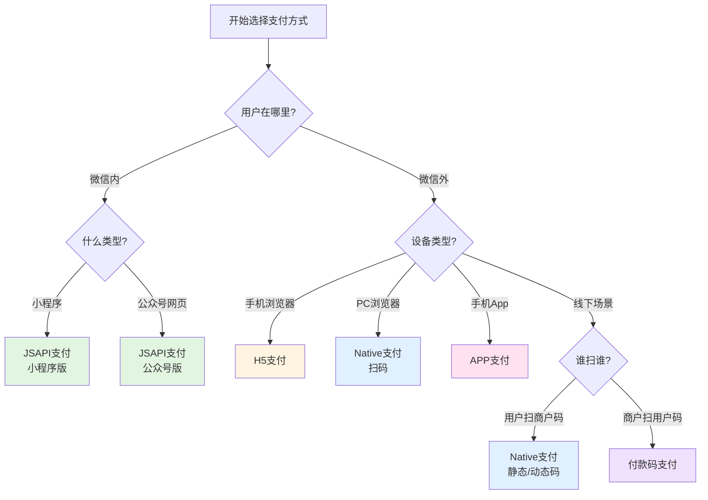
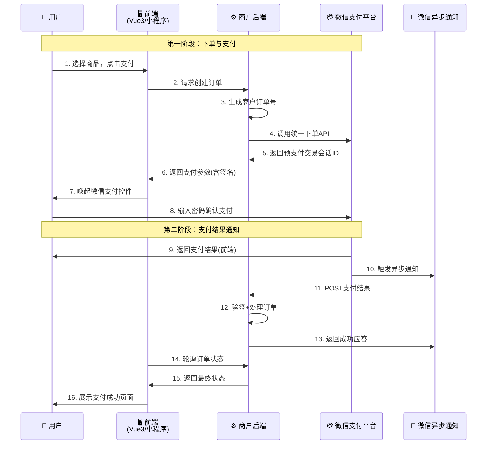
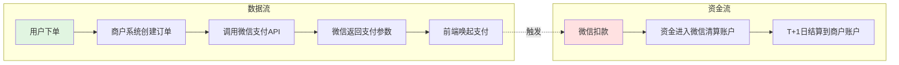
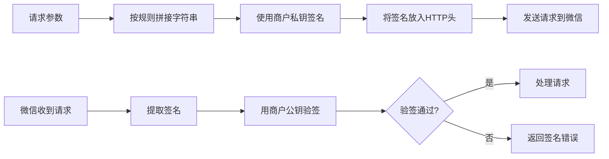
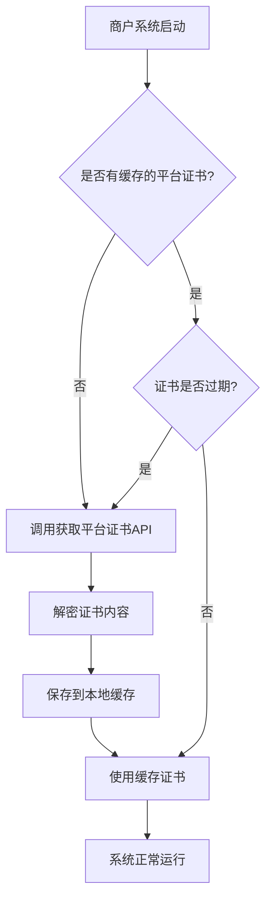
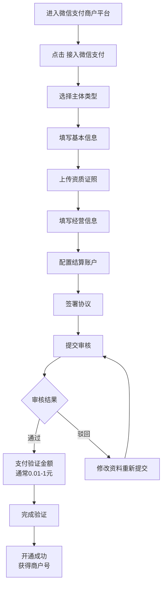

# 微信支付全景认知与准备工作

## 📑 文档目录

1. [文档概述](#文档概述)
2. [微信支付是什么](#微信支付是什么)
   - [产品定位与市场地位](#产品定位与市场地位)
   - [与其他支付方式的对比](#与其他支付方式的对比)
3. [核心产品形态全解析](#核心产品形态全解析)
   - [JSAPI支付](#jsapi支付)
   - [Native支付](#native支付)
   - [H5支付](#h5支付)
   - [APP支付](#app支付)
   - [付款码支付](#付款码支付)
   - [产品形态选择决策树](#产品形态选择决策树)
4. [微信支付核心架构](#微信支付核心架构)
   - [整体架构图](#整体架构图)
   - [参与角色解析](#参与角色解析)
   - [数据流与资金流](#数据流与资金流)
5. [安全机制概览](#安全机制概览)
   - [签名算法体系](#签名算法体系)
   - [证书管理](#证书管理)
   - [敏感信息加密](#敏感信息加密)
6. [商户号申请完整指南](#商户号申请完整指南)
   - [申请条件](#申请条件)
   - [申请流程](#申请流程)
   - [审核要点](#审核要点)
7. [开发环境配置](#开发环境配置)
   - [必备参数清单](#必备参数清单)
   - [沙箱环境配置](#沙箱环境配置)
   - [开发者工具安装](#开发者工具安装)
8. [后续文档导航](#后续文档导航)

---

## 文档概述

**文档目标**：帮助有编程基础的开发者快速理解微信支付的全貌，掌握产品形态选择、核心架构认知，并完成开发前的所有准备工作。

**适用场景**：
- 为电商网站/小程序集成微信支付
- 为公司现有系统对接微信支付
- 学习第三方支付系统的架构设计

**阅读时长**：约 20 分钟

---

## 微信支付是什么

### 产品定位与市场地位

微信支付是腾讯公司基于微信生态推出的第三方支付平台，于2013年正式上线。作为中国移动支付市场的两大巨头之一（另一个是支付宝），微信支付凭借微信的社交属性和庞大用户基础，已覆盖线上线下多个场景。

**核心优势**：
- **社交属性**：天然整合微信聊天、朋友圈、公众号等场景
- **用户基础**：微信月活超12亿，无需额外App安装
- **生态闭环**：小程序、公众号、企业微信深度集成
- **场景丰富**：红包、转账、线下扫码、网页支付等

### 与其他支付方式的对比

| 对比维度 | 微信支付 | 支付宝 | 银联云闪付 |
|---------|---------|--------|-----------|
| **用户基础** | 12亿+（依托微信） | 10亿+（独立App） | 3亿+（银行联盟） |
| **社交属性** | ⭐⭐⭐⭐⭐ | ⭐⭐ | ⭐ |
| **商户费率** | 0.6%（普通商户） | 0.55%-0.6% | 0.38%-0.6% |
| **开发难度** | 中等（文档完善） | 中等 | 较高（文档分散） |
| **小程序生态** | ⭐⭐⭐⭐⭐ | ⭐⭐⭐ | ⭐⭐ |
| **国际化支持** | 一般 | ⭐⭐⭐⭐ | ⭐⭐⭐ |

> **💡 选择建议**：如果您的业务依托微信生态（小程序、公众号），微信支付是首选；如果是独立App或需要国际化，建议同时接入支付宝。

---

## 核心产品形态全解析

微信支付提供5种主要产品形态，每种针对不同的支付场景：

### JSAPI支付

**定义**：用户在微信内置浏览器（包括公众号、小程序）内完成支付。

**适用场景**：
- 微信公众号内的商城
- 微信小程序电商
- 企业微信内部应用

**技术特点**：
- 需要用户openid（微信用户唯一标识）
- 支付过程不跳出微信
- 体验流畅，转化率高

**典型流程**：
```
用户在小程序选购商品 → 点击支付按钮 → 
调起微信支付密码输入 → 支付完成 → 跳转结果页
```

---

### Native支付

**定义**：商户生成支付二维码,用户扫码后在微信内完成支付。

**适用场景**：
- PC网站收银台
- 线下门店收银台
- 自助售货机

**技术特点**：
- 无需获取用户openid
- 二维码可动态生成或预先生成
- 二维码有效期2小时

**典型流程**：
```
用户在PC端下单 → 系统生成支付二维码 → 
用户微信扫码 → 确认支付 → PC端轮询订单状态
```

---

### H5支付

**定义**：用户在手机浏览器（非微信内置浏览器）中唤起微信App完成支付。

**适用场景**：
- 手机外部浏览器（Safari、Chrome等）
- 第三方App内嵌网页
- 短信/邮件链接支付

**技术特点**：
- 会跳转到微信App
- 需要配置H5支付域名
- 对Referer有严格校验

**典型流程**：
```
用户在手机浏览器下单 → 点击支付 → 
跳转到微信App → 确认支付 → 返回浏览器
```

> **⚠️ 注意**：H5支付不能在微信内使用，会被拦截！微信内请使用JSAPI支付。

---

### APP支付

**定义**：用户在商户App内唤起微信App完成支付。

**适用场景**：
- iOS/Android原生App
- React Native/Flutter等混合App

**技术特点**：
- 需要集成微信开放平台SDK
- 需要App在微信开放平台注册
- 支持指纹/FaceID等生物识别

**典型流程**：
```
用户在App内下单 → 点击微信支付 → 
唤起微信App → 确认支付 → 返回商户App
```

---

### 付款码支付

**定义**：用户出示微信付款码，商户扫码完成收款（B扫C）。

**适用场景**：
- 超市收银台
- 餐饮门店
- 停车场缴费

**技术特点**：
- 付款码18位数字，动态刷新
- 单笔限额1000元（可调整）
- 需要商户有线下经营资质

**典型流程**：
```
用户打开微信付款码 → 商户扫描枪识别 → 
系统调用扣款接口 → 支付完成 → 打印小票
```

---

### 产品形态选择决策树



> **💡 快速决策**：
> - 小程序/公众号内 → **JSAPI支付**
> - 手机外部浏览器 → **H5支付**
> - PC网站 → **Native支付**
> - 手机App → **APP支付**
> - 线下门店 → **付款码支付** 或 **Native支付**

---

## 微信支付核心架构

### 整体架构图



### 参与角色解析

| 角色 | 职责 | 关键动作 |
|------|------|---------|
| **用户** | 支付发起方 | 选择商品、确认支付、输入密码 |
| **商户前端** | 用户交互界面 | 收集订单信息、唤起支付控件、展示结果 |
| **商户后端** | 业务逻辑处理 | 生成订单、调用微信API、验证回调、更新订单状态 |
| **微信支付平台** | 支付处理核心 | 扣款、生成交易单号、发送通知 |
| **第三方服务商** *(可选)* | 代理商户接入 | 提供技术支持、分润结算 |

### 数据流与资金流

这是支付系统设计的核心原则之一：**数据流与资金流必须分离**。



**为什么要分离？**
1. **资金安全**：资金流由银行和支付平台监管,商户无法直接操作
2. **对账需求**：数据流可能有延迟/失败,但资金流必须精确
3. **风控要求**：异常交易可以冻结资金流,但不能删除数据流记录

> **💡 核心理念**：永远不要相信前端返回的支付结果！必须等待微信的异步通知或主动查询订单状态。

---

## 安全机制概览

微信支付采用多层安全机制保障交易安全：

### 签名算法体系

**目的**：防止请求参数被篡改,验证请求来源合法性。

**当前使用的签名方式**：
1. **HMAC-SHA256**：商户请求微信时使用（V2接口，逐步淘汰）
2. **RSA-SHA256**：微信V3接口标准（推荐）

**签名流程（以V3为例）**：


**待签名字符串构造规则**（V3）：
```
HTTP方法\n
URL路径\n
时间戳\n
随机字符串\n
请求体\n
```

> **🔒 安全提示**：
> - API密钥（V2）和商户私钥（V3）必须保存在后端,绝不能暴露到前端
> - 每次请求都应生成新的随机字符串
> - 时间戳用于防重放攻击,超过5分钟的请求会被拒绝

---

### 证书管理

微信支付使用双向证书认证：

| 证书类型 | 用途 | 获取方式 |
|---------|------|---------|
| **API证书** | 商户调用敏感接口时使用 | 商户平台下载 |
| **平台证书** | 验证微信返回/回调数据的签名 | 通过API获取 |

**证书更新策略**：
- API证书：手动更新,建议每年更新一次
- 平台证书：自动更新,有效期通常1年,微信会提前通知



---

### 敏感信息加密

**需要加密的场景**：
- 用户身份信息（姓名、身份证号）
- 银行卡信息
- 手机号码

**加密算法**：AES-256-GCM

**加密流程**：
1. 使用微信提供的平台公钥加密敏感字段
2. 将加密后的密文Base64编码
3. 放入请求参数中

> **💡 实践建议**：微信官方提供了各语言的加解密SDK,强烈建议直接使用,不要自己实现。

---

## 商户号申请完整指南

### 申请条件

**主体类型要求**：
- ✅ 企业（有营业执照）
- ✅ 个体工商户
- ✅ 政府/事业单位
- ✅ 其他组织（基金会、社会团体等）
- ❌ 个人（目前不支持）

**必备资料**：
1. 营业执照扫描件/照片
2. 法人身份证正反面
3. 对公账户信息（银行开户许可证或对账单）
4. 经营场景证明（网站ICP备案/App应用市场截图/线下门店照片）
5. 联系人信息（姓名、手机、邮箱）

### 申请流程



**详细步骤**：

**1. 进入申请入口**
- 访问：https://pay.weixin.qq.com/
- 点击右上角"接入微信支付"
- 使用管理员微信扫码登录

**2. 填写基本信息**
```
主体类型: 企业
商户简称: XX科技(显示在支付页面)
客服电话: 400-XXX-XXXX
经营类目: 电商平台-综合电商
```

**3. 上传资质证照**
- 营业执照：确保照片清晰,四角完整,无反光
- 法人身份证：正反面,有效期内
- 开户许可证：如无,可上传对公账户银行对账单

**4. 配置结算信息**
```
结算规则: T+1(次日到账) / T+7(按周结算)
结算账户: 对公账户(企业) / 经营者个人账户(个体户)
```

**5. 签署协议**
- 在线签署《微信支付商户平台服务协议》
- 需法人微信扫码确认

**6. 审核周期**
- 资料提交后：1-3个工作日
- 验证完成后：即时开通

### 审核要点

**常见驳回原因及解决方案**：

| 驳回原因 | 解决方案 |
|---------|---------|
| 营业执照不清晰 | 重新拍照,确保四角完整,无反光无遮挡 |
| 经营范围不符 | 补充营业执照经营范围变更 |
| 网站无ICP备案 | 先完成网站ICP备案再申请 |
| 客服电话无人接听 | 确保审核期间电话畅通 |
| 结算账户名称不一致 | 企业必须用对公账户,户名需与营业执照一致 |

> **⚠️ 重要提示**：
> - 审核期间,微信可能会拨打客服电话核实信息,请保持畅通
> - 小程序/公众号的商户号是独立的,需分别申请
> - 同一主体可申请多个商户号,但每个需单独审核

---

## 开发环境配置

### 必备参数清单

申请通过后,您将获得以下参数,这些是后续开发的核心凭证：

| 参数名称 | 示例 | 用途 | 获取位置 |
|---------|------|------|---------|
| **AppID** | wx1234567890abcdef | 应用唯一标识 | 公众号/小程序后台 |
| **商户号** | 1234567890 | 商户唯一标识 | 商户平台首页 |
| **API密钥(V2)** | 32位随机字符串 | 签名用密钥(旧版) | 商户平台-账户中心-API安全 |
| **APIv3密钥** | 32位随机字符串 | 签名用密钥(新版) | 商户平台-账户中心-API安全 |
| **API证书** | apiclient_cert.pem | 敏感操作验证 | 商户平台-账户中心-API安全 |
| **证书序列号** | 16进制字符串 | 证书标识 | 证书文件内或商户平台 |

**配置文件示例**（请妥善保管,勿上传到代码仓库）：

```javascript
// config/wechat-pay.js
export default {
  // 基本配置
  appId: 'wx1234567890abcdef',
  mchId: '1234567890',

  // V3 API配置（推荐）
  v3Key: '你的APIv3密钥32位',
  serialNo: '你的证书序列号',
  privateKeyPath: '/path/to/apiclient_key.pem', // 商户私钥

  // V2 API配置（部分老接口仍需使用）
  v2Key: '你的API密钥32位',

  // 回调地址
  notifyUrl: 'https://你的域名/api/wechat-pay/notify',

  // 其他配置
  timeout: 10000, // 请求超时时间（毫秒）
}
```

> **🔒 安全规范**：
> - 使用环境变量存储敏感配置
> - 证书文件放在代码仓库外的安全目录
> - 正式环境和测试环境使用不同的商户号
> - 定期（每年）更新API密钥和证书

---

### 沙箱环境配置

**重要说明**：微信支付已于2021年关闭了传统的沙箱环境。目前的测试方案如下：

**方案1：使用真实商户号 + 小额测试**
- ✅ 优点：环境真实,测试结果可靠
- ❌ 缺点：会产生真实交易,需要退款清理
- 💡 建议：每笔测试0.01元,测试完成后批量退款

**方案2：申请服务商测试商户号**
- ✅ 优点：不产生真实交易
- ❌ 缺点：需要成为服务商,申请流程较长
- 📌 申请地址：https://pay.weixin.qq.com/index.php/core/home/partner_login

**方案3：使用微信支付商家助手小程序**
- ✅ 优点：可查看交易详情,方便调试
- ❌ 缺点：仍是真实环境
- 💡 建议：配合方案1使用

**测试账号配置示例**：
```javascript
// config/wechat-pay-test.js
export default {
  appId: 'wx1234567890abcdef',
  mchId: '1234567890',
  v3Key: '测试环境的APIv3密钥',

  // 使用测试回调地址（可通过内网穿透工具暴露本地服务）
  notifyUrl: 'https://test-domain.ngrok.io/api/wechat-pay/notify',

  // 标记为测试环境
  isTest: true,
}
```

---

### 开发者工具安装

**1. 微信开发者工具**（必装）
- 用途：小程序开发与调试
- 下载：https://developers.weixin.qq.com/miniprogram/dev/devtools/download.html
- 功能：
  - 小程序代码编辑与预览
  - 支付接口模拟调用
  - 调试面板查看支付参数

**2. Postman/Apifox**（推荐）
- 用途：后端API接口测试
- 功能：
  - 模拟微信支付回调
  - 签名算法验证
  - 批量测试用例

**3. 内网穿透工具**（本地开发必备）
- 用途：将本地服务暴露到公网,接收微信回调
- 推荐工具：
  - **ngrok**：https://ngrok.com/ （国外服务,稳定但需付费）
  - **natapp**：https://natapp.cn/ （国内服务,免费版有限制）
  - **花生壳**：https://hsk.oray.com/

**ngrok使用示例**：
```bash
# 1. 安装ngrok
npm install -g ngrok

# 2. 启动本地服务（假设运行在3000端口）
npm run dev

# 3. 暴露端口到公网
ngrok http 3000

# 4. 复制生成的https地址（如 https://abc123.ngrok.io）
# 5. 将该地址配置到微信支付的回调地址中
```

**4. 微信支付官方SDK**（可选）
- Node.js：`wechatpay-node-v3`
- Java：`wechatpay-apache-httpclient`
- Python：`wechatpayv3`
- PHP：`wechatpay-php`

**安装命令**（以Node.js为例）：
```bash
npm install wechatpay-node-v3
```

---

## 后续文档导航

恭喜您完成了第一份文档的学习！现在您已经：
- ✅ 理解了微信支付的5种产品形态
- ✅ 掌握了核心架构和安全机制
- ✅ 完成了商户号申请和环境配置

**接下来的学习路径**：

📄 **文档2：技术架构深度解析**
- 完整交易流程详解
- 签名算法实战演练
- 证书管理自动化方案
- 回调机制与验签实现

📄 **文档3：Vue3 网页支付实战**
- H5支付完整代码
- JSAPI支付（公众号场景）
- 支付SDK封装与复用
- 前端工程化最佳实践

📄 **文档4：微信小程序支付实战**
- 小程序支付完整流程
- 统一下单API调用
- 原生/uni-app双版本实现
- 支付后状态管理方案

📄 **文档5：架构设计与问题排查**
- 支付系统设计原则
- 50+常见问题速查表
- 生产环境检查清单
- 通用支付系统架构

---

## 📚 参考资料

- [微信支付官方文档](https://pay.weixin.qq.com/wiki/doc/apiv3/index.shtml)
- [微信支付商户平台](https://pay.weixin.qq.com/)
- [微信开放社区](https://developers.weixin.qq.com/community/pay)
- [微信支付开发者文档](https://pay.weixin.qq.com/wiki/doc/api/index.html)
- [微信支付APIv3文档](https://pay.weixin.qq.com/wiki/doc/apiv3/index.shtml)
- [微信支付签名算法](https://pay.weixin.qq.com/wiki/doc/apiv3/wechatpay/wechatpay4_0.shtml)
- [微信支付证书指引](https://pay.weixin.qq.com/wiki/doc/apiv3/wechatpay/wechatpay5_1.shtml)
- [微信支付回调通知](https://pay.weixin.qq.com/wiki/doc/apiv3/wechatpay/pay/chapter3_1.shtml)